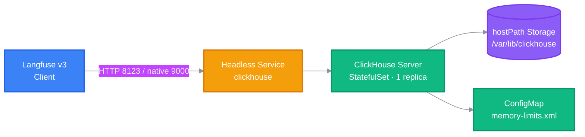

<h1 align="center">ClickHouse</h1>

<p align="center">
  <strong>Analytical database for Langfuse v3, deployed as a single-node Kubernetes StatefulSet.</strong>
  <br />
  <em>HTTP 8123 · Native TCP 9000 · Atomic engine · hostPath persistent storage</em>
</p>

<p align="center">
  <a href="#quick-start"></a>
  <a href="LICENSE"></a>
</p>

<p align="center">
  <a href="https://docs.anthropic.com/en/docs/claude-code"></a>
  <a href="https://github.com/features/copilot"></a>
  <a href="https://cursor.sh"></a>
</p>

<p align="center">
  
  
  
</p>

<!-- BEAUTIFIED -->

---

## Features

- **Fixed DNS identity** — A headless Service of the same name resolves `<pod>.clickhouse.default.svc.cluster.local`, giving the rest of the stack a stable connection target.
- **Two protocol surfaces** — HTTP on `8123` for the Langfuse API, native TCP on `9000` for native clients and migration traffic.
- **Persistent local storage** — Data lives on a node-local hostPath mount (`/var/lib/clickhouse`), so analytical data survives pod restarts and rescheduling.
- **Survivable updates** — RollingUpdate strategy with a single replica keeps the database reachable across image changes.
- **Bounded resource footprint** — Requests of `250m` CPU / `512Mi` memory with limits of `1` CPU / `2Gi` memory.
- **Override-ready server config** — A ConfigMap mounts `memory-limits.xml` into `/etc/clickhouse-server/config.d/` for engine tuning without editing the image.

---

## Quick Start

### Prerequisites

- A Kubernetes cluster with `kubectl` configured.
- The host path `/mnt/workspaces/clickhouse/data` must exist on the target node (see [Deployment](#deployment)).

### Apply the Secret

```bash
kubectl apply -f k8s/clickhouse-secret.yaml
```

### Deploy the Service and StatefulSet

```bash
kubectl apply -f k8s/clickhouse-statefulset.yaml
kubectl wait --for=jsonpath='{.items[0].ready}' pod -l app=clickhouse
```

### Verify

```bash
kubectl port-forward svc/clickhouse 8123 &>/dev/null & sleep 1
curl http://localhost:8123/ping
```

---

## Usage

### HTTP liveness probe

```bash
curl http://localhost:8123/ping
```

### Authenticated query (REST interface)

The password lives in the `clickhouse-secret` Secret and is resolved at query time:

```bash
PW=$(kubectl get secret clickhouse-secret -ojsonpath='{.stringData.CLICKHOUSE_PASSWORD}') && \
curl --user "clickhouse:$PW" 'http://localhost:8123/?query=SELECT+version()'
```

### Native client inside the pod

```bash
kubectl exec sts/clickhouse -- clickhouse-client \
  "SHOW DATABASES; SHOW CREATE TABLE default.traces LIMIT 1;"
```

### Data directory footprint

```bash
kubectl exec sts/clickhouse -- clickhouse-client \
  "SELECT hostName(), path, formatReadableSize(sum(size_bytes)) AS bytes
   FROM system.parts GROUP BY hostName(), path;"
```

> The manifest sets `CLICKHOUSE_DB=langfuse`, but the live schema (traces, observations, scores, analytics_*) resides in the `default` database. Query against `default.*` or verify the database name with `SHOW DATABASES` before writing SQL.

---

## Architecture

Langfuse communicates with ClickHouse over the headless Service, which resolves to the single StatefulSet replica. Analytical data is written to a node-local hostPath volume mounted at `/var/lib/clickhouse`, so it survives pod restarts.



The cluster runs a single shard with no ZooKeeper — effectively `CLICKHOUSE_CLUSTER_ENABLED=false`. Observed runtime config enables `sha256_password` auth but also allows plaintext and empty passwords; front the exposed ports with TLS or a reverse proxy when running beyond a trusted network.

---

## Configuration

### Environment Variables

Surfaced into the Pod from the `clickhouse-secret` Secret via `envFrom`, plus one explicit env override:

| Variable | Source | Default | Notes |
|---|---|---|---|
| `CLICKHOUSE_USER` | Secret | `clickhouse` | Auth user the Langfuse stack connects as. |
| `CLICKHOUSE_PASSWORD` | Secret | *(redacted)* | Plaintext `stringData` in `k8s/clickhouse-secret.yaml` (gitignored) — rotate before any push. |
| `CLICKHOUSE_DB` | Pod env | `langfuse` | Default database in the manifest; the live schema resides in the `default` database (see [Usage](#usage)). |

### Server Overrides (ConfigMap)

| Setting | Value | Effect |
|---|---|---|
| `max_server_memory_usage` | `1073741824` (1 GiB) | Caps total server memory usage. |
| `mark_cache_size` | `134217728` (128 MiB) | Bounds the mark cache. |

---

## API

The instance exposes the standard ClickHouse interfaces:

| Interface | Port | Notes |
|---|---|---|
| HTTP / REST | `8123` | Primary interface used by Langfuse; `/ping` for health, `/?query=...` for queries. |
| Native TCP | `9000` | Native client protocol and server-to-server / migration traffic. |

---

## Project Structure

```
clickhouse/
├── k8s/                       # Kubernetes manifests (namespace: default)
│   ├── clickhouse-secret.yaml        # Credentials, gitignored
│   ├── clickhouse-configmap.yaml     # ConfigMap: memory-limits.xml override
│   └── clickhouse-statefulset.yaml   # Headless Service + StatefulSet (single YAML)
├── data/                      # Live server state (gitignored, mirrors running pod)
│   ├── metadata/              # DDL files (default.sql, system.sql)
│   ├── preprocessed_configs/  # Machine-merged server config
│   └── status                 # Runtime markers (PID, revision)
├── README.md
├── LICENSE
└── AGENTS.md
```

`data/` is a mirror of the running server's files. It is regenerated by the live server on restart — do not edit it to change schema; use SQL through the HTTP or native interface instead.

---

## Tech Stack

### Database

| Technology | Purpose |
|---|---|
| ClickHouse | Analytical database engine (Atomic databases, single-node) |

### Infrastructure

| Technology | Purpose |
|---|---|
| Kubernetes | Orchestration — StatefulSet + headless Service, `default` namespace |
| hostPath volume | Node-local persistent storage mounted at `/var/lib/clickhouse` |
| ConfigMap | Server config overrides in `/etc/clickhouse-server/config.d/` |
| Docker image | `clickhouse/clickhouse-server:latest` |

---

## Deployment

Apply manifests in dependency order so later objects can resolve their references.

```bash
# 1) Secret first — auth must exist before the Pod's envFrom resolves
kubectl apply -f k8s/clickhouse-secret.yaml

# 2) Headless Service + StatefulSet (two documents separated by ---)
kubectl apply -f k8s/clickhouse-statefulset.yaml
```

> Path quirk: this workspace tree is at `/Users/kevin/Workspaces/clickhouse/data`, but the pod mounts the node-local path `/mnt/workspaces/clickhouse/data`. Host paths resolve on the node running the pod, not in this filesystem — create the path on each target node before applying, or the server starts with an empty data directory.

---

## Contributing

1. Fork the repository
2. Create a feature branch (`git checkout -b feature/improvement`)
3. Commit your changes (`git commit -m 'feat: add improvement'`)
4. Push to the branch (`git push origin feature/improvement`)
5. Open a Pull Request

---

## License

[MIT](LICENSE)
